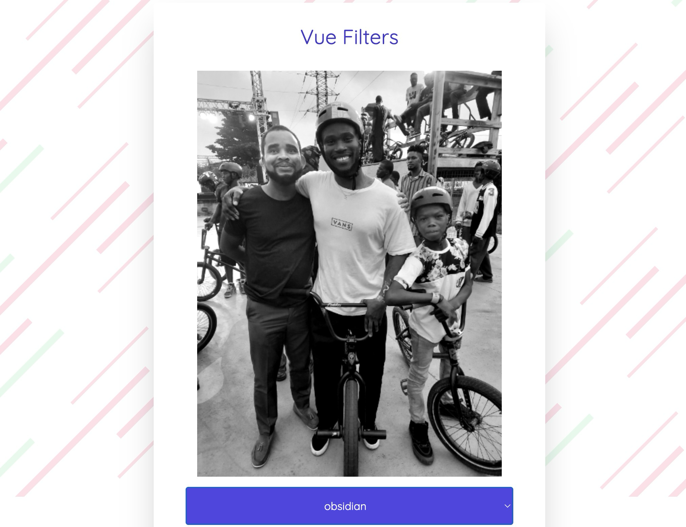

# Image Filter

A Vue application that allows users to apply various filters to images in real-time.



## Features

- Real-time image filtering
- Multiple filter options (e.g., grayscale, sepia, blur)
- User-friendly interface
- Responsive design

## Recommended IDE Setup

For the best development experience, we recommend using [VSCode](https://code.visualstudio.com/) with the [Volar](https://marketplace.visualstudio.com/items?itemName=Vue.volar) extension.

## Project Setup

To get started with the project, follow these steps:

### 1. Clone the repository

```sh
git clone https://github.com/yourusername/image-filter.git
cd image-filter
```

### 2. Install dependencies

```sh
npm install
```

## Development

### Compile and Hot-Reload for Development

```sh
npm run dev
```

## Usage

1. Upload an image by dragging and dropping.
2. Select a filter from the available options.
3. Download the filtered image.

## Contributing

Contributions are welcome! Please open an issue or submit a pull request.

## License

This project is licensed under the MIT License.
